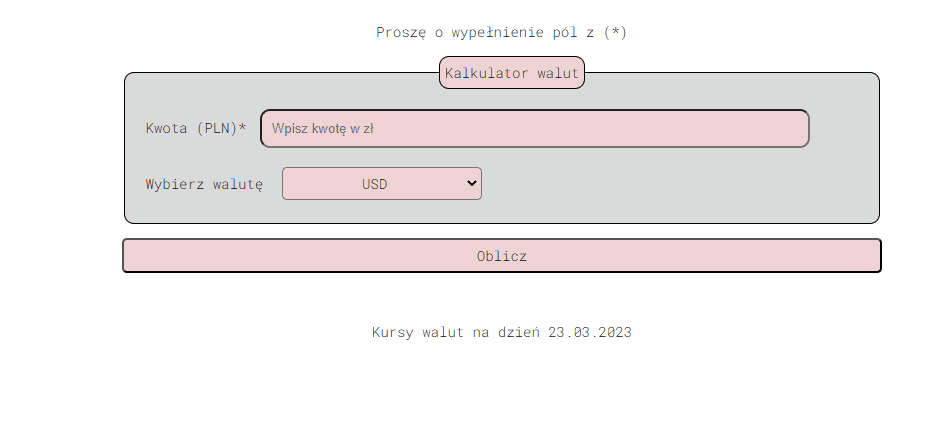

# Currency converter
This project presents a currency calculator. It is a simple calculator in which you can enter the PLN currency and convert it into other currencies. The currencies used in the calculator are:
- USD
- EUR
- CHF
- GBP
- CNY

The following shows how the currency calculator works.

## Demo Currency Calculator

The following is the homepage of the currency calculator.

[Currency-Calculator](https://mateuszwozniak97.github.io/currency-converter/)

## Technologies
Currency Calculator is created with:
- HTML5
- CSS
- JavaScript
- BEM 

## Basic features of the homepage
- Currency Calculator is responsive on website and mobile phone,
- Bem added for easier code review,
- Added a button that converts the selected PLN amount to another currency using JavaScript

## The future of Currency Calculator

In the future, I would like to improve the calculator so that more currencies can be selected and the currency calculator can download the latest rates from another site.

## Contact
If you would like to talk or give other tips I invite you to contact me at (mw544@gmail.com).